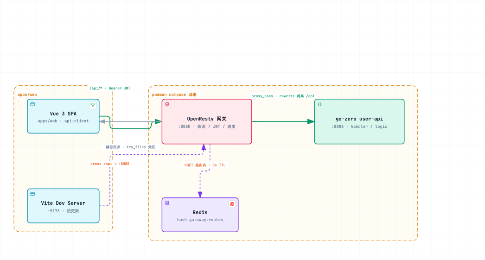

# gozero-vue-openresty-monorepo

Go-zero + Vue 3 + OpenResty 的 Monorepo 工程模板:契约先行的前后端协作、网关层统一鉴权/限流/动态路由、容器一键启动。

- 前端:Vue 3 + Vite + TypeScript + vue-router + ECharts(pnpm workspace 管理)
- 后端:go-zero REST 服务(`.api` 契约驱动,goctl 生成)+ forecast-api(FastAPI + PyTorch,CNN+Transformer 时序预测/耦合失效检测)
- 网关:OpenResty(Lua 实现 JWT 验签、漏桶限流、Redis 动态路由)
- 构建:Turborepo 任务编排;容器:podman compose / docker compose

## 架构



职责边界：业务逻辑在业务服务（go-zero user-api / Python forecast-api）；网关只做流量管理（限流、鉴权、路由、静态托管），不含业务代码。forecast-api 是 ML 服务的例外说明：模型训练/推理依赖 PyTorch 生态，用 Python 实现并复用网关的鉴权与路由（信任网关注入的 `X-User`，直连时兜底校验 Bearer）。

> 交互版（主题切换、聚焦视图、PNG/SVG 导出）：[docs/architecture.html](docs/architecture.html)，规格源文件 [docs/architecture.json](docs/architecture.json)

### 一次典型请求的完整链路

1. 前端调用 `@gozero-monorepo/api-client` 的 `userInfo()`,实际请求 `GET /api/user/info`,携带 `Authorization: Bearer <token>`
2. 网关限流检查:超出 10 req/s + burst 20 直接返回 429
3. `/user/info` 不在白名单,Lua 用共享 secret 验签;失败返回 401,成功把 `sub` 写入 `$x_user`
4. `rewrite` 把 `/api/user/info` 改写为 `/user/info`,`proxy_pass` 到动态解析的 upstream
5. go-zero handler 从请求上下文取 `X-User`,logic 层返回用户信息
6. 响应按原路返回;后端不可达时网关 502/504,user-api 容器重启后 5 秒内自动恢复(DNS TTL)

## 目录结构

```text
.
├── apps/
│   ├── web/                    Vue 3 前端
│   │   ├── src/views/          HomeView(登录+用户信息)、AboutView
│   │   └── vite.config.ts      /api 代理到网关 :8080
│   ├── gateway/                OpenResty 网关
│   │   ├── conf/nginx.conf.template   resolver 占位符由 entrypoint 注入
│   │   ├── docker-entrypoint.sh       从 /etc/resolv.conf 提取 DNS 生成 nginx.conf
│   │   ├── lua/
│   │   │   ├── gateway.lua     access 阶段入口:限流→验签→路由(按前缀分发到 user-api / forecast-api)
│   │   │   ├── jwt.lua         HS256 验签(FFI 直调 OpenSSL HMAC,零第三方依赖)
│   │   │   ├── auth.lua        Bearer token 解析 + secret 管理
│   │   │   ├── ratelimit.lua   漏桶限流(resty.limit.req)
│   │   │   └── router.lua      Redis 路由表读取(5s 缓存,失败回退默认)
│   │   └── vendor/resty/limit/ 纯 Lua 依赖源码(license 见文件头)
│   ├── forecast-api/          CNN+Transformer 时序预测服务(Python FastAPI + PyTorch)
│   │   ├── app/
│   │   │   ├── ml/             与参考分析逐句等价的移植(univariate/multivariate 管线)
│   │   │   ├── jobs.py         内存 job 管理(后台线程训练,最近 20 个)
│   │   │   ├── comparison.py   与参考 metrics 的容差比对
│   │   │   └── main.py         REST 路由(/forecast/*,信任 X-User)
│   │   ├── reference/          参考分析产出的基准 metrics(比对照实源)
│   │   └── tests/              pytest:API 集成 + 慢速 parity 测试(-m slow)
│   └── user-api/               go-zero 服务
│       ├── user.api            API 契约(唯一事实源)
│       ├── etc/user-api.yaml   监听地址、JWT secret、演示凭据
│       └── internal/           handler(请求解析)/ logic(业务)/ types(生成)
├── packages/
│   ├── api-client/             契约生成的 TS 类型 + fetch 封装
│   │   ├── src/generated/      goctl api ts 产物(勿手改)
│   │   └── src/forecast.ts     forecast-api 的手写类型与封装
│   └── shared-utils/           前端通用工具函数
├── docker-compose.yml          redis + user-api + forecast-api + gateway
├── pnpm-workspace.yaml
└── turbo.json
```

## 核心设计决策

| 决策 | 原因 |
|---|---|
| 契约先行:`.api` 是接口唯一事实源 | 后端 Go 代码与前端 TS 类型从同一份 `user.api` 生成,编译期消除字段不匹配 |
| 网关验签,后端信任 `X-User` | token 校验收敛在一处;user-api 保留 Bearer 解析兜底,支持绕过网关直连调试 |
| JWT 验签用 FFI 直调 OpenSSL | alpine 镜像的 luarocks 无法解析 luarocks.org manifest(Lua 5.1 常量上限);验签只需 HMAC-SHA256 + base64url + cjson,60 行内实现,算法钉死 HS256 防混淆攻击 |
| entrypoint 动态生成 resolver | podman/docker 的容器 DNS 地址不同;启动时从 `/etc/resolv.conf` 提取,配合变量 `proxy_pass` 实现 upstream 按 TTL 解析,后端容器重启换 IP 后无需 reload |
| 错误响应统一 `{"message": "..."}` | go-zero 默认纯文本;`httpx.SetErrorHandlerCtx` 统一为 JSON,与 api-client 的错误解析对齐 |
| 限流 fail-open | Redis/limiter 故障时放行流量,限流器故障不应拖垮入口 |

## 快速开始

前置要求:Node 22+、pnpm 9、Go 1.26、podman(或 docker)。

```bash
# 1. 安装依赖并构建前端产物(网关挂载 dist)
pnpm install
pnpm build:web

# 2. 启动全部容器(redis / user-api / forecast-api / gateway)
podman compose up -d --build
# docker 用户:docker compose up -d --build

# 3. 验证
curl -i http://localhost:8080/api/user/ping
```

关于 macOS 上的 podman machine:

- `podman compose`(实测 podman 6.0.2)会自动把 machine 连接注入给 compose provider(docker-compose),无需设置任何环境变量
- 仅当绕过 `podman compose` 直接使用 `docker-compose` 命令时,才需要把 `DOCKER_HOST` 指向 machine 的 API socket(默认在 `$TMPDIR/podman/podman-machine-default-api.sock`,rootless machine 的默认位置):

```bash
export DOCKER_HOST="unix://${TMPDIR}podman/podman-machine-default-api.sock"
```

该 socket 路径与镜像/卷存储位置无关(存储在 machine 虚拟机内,`podman info` 的 `graphRoot` 可见)。

查看日志与状态:

```bash
podman compose ps
podman logs gozero-vue-openresty-monorepo-gateway-1
podman logs gozero-vue-openresty-monorepo-user-api-1
podman logs gozero-vue-openresty-monorepo-forecast-api-1
```

## 验证手册

演示凭据:`admin / admin123`。以下命令均在本仓库实测通过。

### 0. 时序预测系统(forecast)

前端:`open http://localhost:8080/forecast`(登录后):

1. 「单变量时序预测」:默认 epochs=20 运行,展示指标卡、模型 vs 持久性基线回归指标、
   原始序列/损失曲线/预测对比/残差分布/散点 5 张图,以及与参考分析指标的逐项容差比对表
2. 「多变量耦合失效检测」:默认 epochs=30,顺序训练 phase_swap / actuator_lag
   两模式各 3 个模型(多变量/单变量/单变量)+ EWMA 基线,展示方法对照表、
   通道/评分/EWMA/耦合散点 4 张图与比对表;任务可轮询进度、从历史恢复

API(经网关鉴权):

```bash
TOKEN=$(curl -s -X POST http://localhost:8080/api/auth/login \
  -H 'Content-Type: application/json' \
  -d '{"username":"admin","password":"admin123"}' | python3 -c "import sys,json;print(json.load(sys.stdin)['token'])")

# 提交单变量实验(epochs 缺省 20,与参考一致)
curl -s -X POST http://localhost:8080/api/forecast/jobs \
  -H "Authorization: Bearer $TOKEN" -H 'Content-Type: application/json' \
  -d '{"kind":"univariate"}'
# 轮询状态与结果(GET /forecast/jobs/{id},完成后 result 含指标、图表数据与参考比对)
curl -s -H "Authorization: Bearer $TOKEN" http://localhost:8080/api/forecast/jobs/<id>
```

一致性验证(本机实测):

- 单变量:persistence 基线与残差统计与参考逐位一致;模型指标在容差内
  (容器内 torch 为 cu130 构建,与宿主构建存在微小浮点漂移)
- 多变量:corr/b_marginal 与参考逐位一致;报警率/检出延迟在容差内,
  定性结论不变(多变量模型在两种故障模式下均能检出,单变量/EWMA 在
  actuator_lag 模式下接近全盲)
- 本地全量 parity 测试:`cd apps/forecast-api && uv run pytest -m slow`

### 1. 静态托管与 history 路由

```bash
curl -s http://localhost:8080/          # 返回 Vue SPA 的 index.html
curl -i http://localhost:8080/about     # 200 + text/html,try_files 兜底
```

### 2. 公开接口(白名单,免鉴权)

```bash
curl -i http://localhost:8080/api/user/ping
# HTTP/1.1 200
```

### 3. 登录:签发 JWT

```bash
# 错误密码 → 400 + JSON
curl -i -X POST http://localhost:8080/api/auth/login \
  -H 'Content-Type: application/json' \
  -d '{"username":"admin","password":"wrong"}'
# HTTP/1.1 400 {"message":"invalid username or password"}

# 正确密码 → token
curl -s -X POST http://localhost:8080/api/auth/login \
  -H 'Content-Type: application/json' \
  -d '{"username":"admin","password":"admin123"}'
# {"token":"eyJhbGciOiJIUzI1NiIs...","expiresIn":86400}
```

### 4. 网关鉴权

```bash
TOKEN=<上一步返回的 token>

# 无 token → 网关 401
curl -i http://localhost:8080/api/user/info

# 篡改签名 → 网关 401
curl -i -H "Authorization: Bearer ${TOKEN%?}x" http://localhost:8080/api/user/info

# 有效 token → 200,用户信息来自网关注入的 X-User
curl -i -H "Authorization: Bearer $TOKEN" http://localhost:8080/api/user/info
# {"id":1,"username":"admin","email":"admin@example.com"}
```

验签失败的拒绝原因在网关日志:`podman logs ...gateway-1 | grep "jwt verification failed"`。

### 5. 限流(10 req/s, burst 20)

```bash
python3 - <<'EOF'
import concurrent.futures, urllib.request, collections
def hit(_):
    try: return urllib.request.urlopen("http://localhost:8080/api/user/ping", timeout=30).status
    except urllib.error.HTTPError as e: return e.code
with concurrent.futures.ThreadPoolExecutor(60) as ex:
    codes = collections.Counter(ex.map(hit, range(60)))
print(dict(codes))
EOF
# 实测:{200: 21, 429: 39}
```

curl 串行/低并发不会触发(达不到速率阈值);需并发压测。

### 6. Redis 动态路由(不重载 Nginx 切换 upstream)

```bash
# 写入错误地址,5s 缓存过期后生效 → 504(连接不可达)
podman exec gozero-vue-openresty-monorepo-redis-1 \
  redis-cli HSET gateway:routes user-api 10.255.255.1:8888
sleep 6
curl -i http://localhost:8080/api/user/ping

# 删除覆盖 → 回退默认 upstream,恢复 200
podman exec gozero-vue-openresty-monorepo-redis-1 \
  redis-cli HDEL gateway:routes user-api
sleep 6
curl -i http://localhost:8080/api/user/ping
```

路由表结构:Redis hash `gateway:routes`,field 为服务名(`user-api` / `forecast-api`),value 为 `host:port`。

### 7. 后端重启自愈

```bash
podman restart gozero-vue-openresty-monorepo-user-api-1
# 每 3 秒重试,实测 6 秒内从 502 恢复 200(resolver TTL 5s)
```

### 8. 浏览器端到端

```bash
pnpm build:web && podman compose up -d   # 确认 dist 已更新并挂载
open http://localhost:8080
```

1. 首页输入 `admin / admin123` 登录,展示 id/username/email
2. 刷新页面仍保持登录态(token 存 localStorage,自动注入请求头)
3. 点击 Logout 后访问受限接口返回 401
4. 直接访问 `/about` 不出现 404(history 路由由网关兜底)

### 9. 前端开发模式

```bash
pnpm dev            # Vite :5173,/api 代理到网关 :8080
open http://localhost:5173
```

修改前端代码热更新,请求仍走完整网关链路(限流/鉴权全部生效)。

## 开发工作流

### 修改 API 契约

```bash
# 1. 编辑 apps/user-api/user.api
# 2. 重新生成 Go 骨架与 TS 类型(logic 层不会被覆盖)
pnpm generate:api
# 等价于:
#   goctl api go -api apps/user-api/user.api -dir apps/user-api --style goZero
#   goctl api ts --api apps/user-api/user.api --dir packages/api-client/src/generated --unwrap
# 3. 在 packages/api-client/src/index.ts 中为新路由补一层带鉴权的封装
# 4. 在 apps/user-api/internal/logic/ 实现业务逻辑
```

新增路由后 `routes.go`、handler、logic、types 全部由 goctl 生成;已实现的 logic 文件保持不动。

### 新增后端服务

在 `apps/` 下新建目录,重复 user-api 的结构;网关侧在 `gateway.lua` 的服务分发中注册前缀,并在 `router.lua` 的 `DEFAULT_UPSTREAMS` 与环境变量中注册默认 upstream,Redis `gateway:routes` 的 field 与服务名对应。forecast-api(Python/FastAPI)是现成的非 go-zero 服务接入范例。

## 配置参考

| 变量 | 作用域 | 默认值 | 说明 |
|---|---|---|---|
| `JWT_SECRET` | user-api / gateway / forecast-api | `dev-only-jwt-secret-change-me` | 各端必须一致;生产环境务必覆盖 |
| `REDIS_HOST` | gateway | `redis` | 动态路由的 Redis 地址 |
| `USER_API_UPSTREAM` | gateway | `user-api:8888` | 无 Redis 覆盖时的默认 upstream |
| `FORECAST_API_UPSTREAM` | gateway | `forecast-api:8000` | forecast-api 的默认 upstream |

演示凭据(`admin/admin123`)配置在 `apps/user-api/etc/user-api.yaml`,接入数据库后替换 loginLogic 中的校验逻辑。

## 已知限制(生产前需处理)

- 演示凭据为内存校验,无数据库、无密码哈希
- `JwtSecret` 通过 compose 明文传递,生产应换用 secret 管理系统
- Redis 动态路由无认证,Redis 需限制网络访问
- 限流维度仅按客户端 IP(podman/docker 环境下所有请求来自转发层同一 IP)
- forecast-api 的 job 存内存(重启丢失,保留最近 20 个);模型每次训练现训,无持久化权重
- goctl 生成的 `gocliRequest.ts` 未被使用,api-client 自带 fetch 封装以支持 baseUrl 与 token 注入

## CI

`.github/workflows/ci.yml`:push/PR 触发三个并行 job——web(pnpm install + turbo build,含 vue-tsc 类型检查)、user-api(`go build` + `go vet`)与 forecast-api(`uv sync` + `ruff check` + pytest 快速集;全量 parity 测试 `-m slow` 仅本地跑)。
